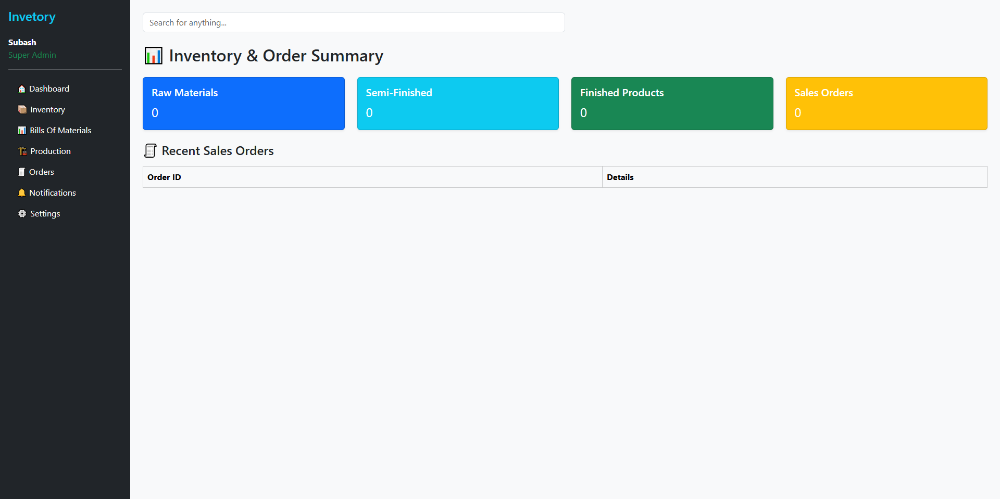
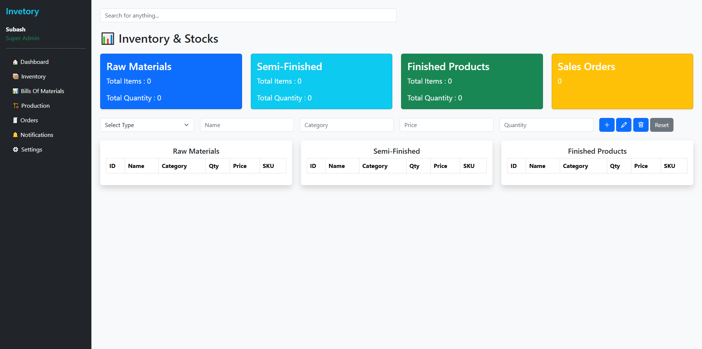
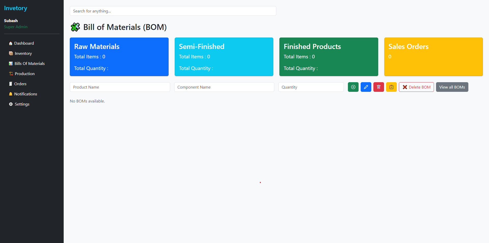
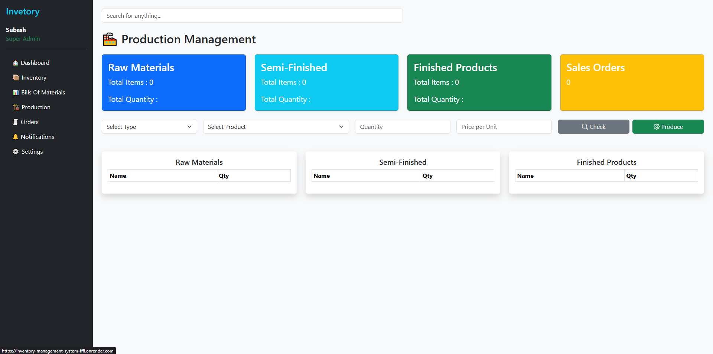

# FluxStock

A powerful, modular inventory management system built with Python and Flask, designed to streamline stock tracking, manage raw materials, semi-finished and finished goods, and enable efficient production workflows. Ideal for small to medium-scale manufacturers and distributors.
---

<h2>📊 Dashboard View</h2>

<h2>📦 Inventory View</h2>

<h2>🧾 BOM View</h2>

<h2>🏭 Production View</h2>

## 🔧 Features

✅ User-Friendly Dashboard with real-time inventory summaries

📁 Raw Material, Semi-Finished, and Finished Product Management

🔄 Production Module to convert materials based on BOM (Bill of Materials)

🧮 Automatic SKU Generation

⚙️ Stock In/Out Management

🚨 BOM Validation and Inventory Check before production

---

## 🏗️ Tech Stack

Backend: Python, Flask

Frontend: HTML, BootStrap, JavaScript, Jinja2

Data Handling: MySQL (modular database-based backend)

(Planned: SQLite/MySQL integration for scalable storage)

---

## 📁 Folder Structure

/backend         → Business logic and inventory modules  
/templates       → Jinja2 HTML pages  
/database        → Database Logic and SQL queries
app.py           → Flask application entry point 
---

## 🚀 Upcoming Features
Supplier and Sales Order Management

Multi-location Inventory Tracking

Barcode Integration

Forecasting & Advanced Analytics

Mobile/PWA support

Basic Reports & Inventory Insights (exportable)

---

## 📌 Getting Started

Just visit this url :- https://inventory-management-system-fffl.onrender.com (v1: Lite & working demo ✅)

or

Clone the repo

Install dependencies: pip install -r requirements.txt

Run the app: python app.py

Access at: http://127.0.0.1:5000/

---

## 📄 License

This project is licensed under the **MIT License**.  
Feel free to use, modify, and distribute it for personal or commercial purposes.  

See the [LICENSE](LICENSE) file for full license text.

